# MiyKo

The project for the [AI-Factory by Silpo](https://ai-factory.silpo.ua/) hackathon.

## Idea

MiyKo is a food AI agent that turns shared purchases for a household or another group into durable, memory-backed workflows. A family dinner, office pizza party or picnic starts as one conversation where members add requests, roles determine who may change or approve them, and the same workflow continues until the provider basket and fulfillment are confirmed.

Long-term memory belongs to the household and its members rather than one chat. It carries preferences and previous purchases into future workflows, making it possible to repeat an earlier order or select better products. Important decisions remain under human control.

The MVP is household-first, but the workflow model also supports temporary groups. Future workflow kinds include scheduled and recurring orders, multi-store comparison, temporary delegation and consensus approval.

## Ідея

«МійКо» — харчовий AI-агент, який перетворює спільні закупівлі сім’ї або групи людей на керовані робочі сценарії — workflows. Для сімейної вечері, офісної pizza party чи пікніка учасники додають побажання в одному чаті. Процес зберігається між діями: його можна продовжити пізніше, запланувати на певний час, повторювати регулярно або використати для порівняння кошиків у кількох магазинах-провайдерах. Довготривала пам’ять прив’язана до групи і її учасників, а не лише до одного чату: вона враховує вподобання та попередні покупки, дозволяє повторити минуле замовлення або точніше підібрати товари. МійКо самостійно допомагає скласти план, виконати заміни, вибрати доставку й довести покупку до оформлення, залишаючи важливі рішення за людиною. Технічно рішення поєднує LangChain's LangGraph для тривалих workflows, Mem0 для довготривалої пам’яті та multi-provider архітектуру для роботи з різними сервісами.

## What it is

MiyKo consists of one mobile AI-agent experience and five clear runtime boundaries:

- **Expo app:** household setup, shared requests, approvals and basket presentation;
- **Hono API:** authentication, permissions, provider connection, workflow references and reliable action delivery;
- **LangChain + LangGraph:** long-running workflows that pause, resume and keep their state between actions;
- **Mem0:** long-term household/member memory across chats and workflows;
- **Store providers:** current products, prices, basket, fulfillment and checkout through Silpo MCP today and additional providers later.

MiyKo does not maintain its own recipe, product or order catalog. PostgreSQL is a thin control-plane projection for identity, permissions, provider bindings, workflow references, approvals and outbox delivery state.

## How it works

```text
login/register → create or join household → owner connects Silpo once
  → member starts a workflow from text or audio
  → workflow reads relevant long-term memory
  → members add or change requests
  → workflow pauses when owner/admin approval is required
  → the same workflow resumes after the decision
  → Silpo MCP creates or updates the real basket
  → owner completes checkout in Silpo
```

The current workflow kind is `step-order`. “Add ice cream” is a workflow action, not a local product search. The provider returns current products, images, prices and basket state. Replacements, pickup/delivery and delivery slots remain steps in the same workflow.

Future workflow directions are documented in [docs/idea.md](docs/idea.md):

- `scheduled-order`;
- `recurring-order`;
- `multi-store-order`;
- `delegated-order`;
- `consensus-order`.

## Run locally

### Requirements

- Node.js `24.19.x`;
- pnpm `11.x`;
- Docker with Docker Compose;
- OpenAI API key;
- Mem0 API key;
- a Silpo account for browser OAuth during the demo.

### 1. Configure the environment

From the repository root:

```bash
cp .env.example .env
cp apps/workflows/.env.example apps/workflows/.env
cp apps/app/.env.example apps/app/.env
```

In the root `.env`:

- add `MEM0_API_KEY` for API-side memory import;
- generate `PROVIDER_SECRETS_ENCRYPTION_KEY` with `openssl rand -hex 32`;
- keep `LANGGRAPH_API_URL=http://127.0.0.1:2024` for the local workflow server;
- configure the exact Silpo OAuth callback registered with the provider.

In `apps/workflows/.env`, add `OPENAI_API_KEY` and the same `MEM0_API_KEY`. In `apps/app/.env`, set `EXPO_PUBLIC_API_URL` to the API address reachable by the app.

### 2. Install dependencies

```bash
pnpm install
```

### 3. Start PostgreSQL and prepare demo data

```bash
docker compose up -d postgres
set -a
source .env
set +a
pnpm --filter @miyko/database db:migrate
pnpm seed:demo
```

Every `pnpm seed:demo` run creates new random user, member and household IDs. Existing demo users are preserved under timestamped `+archived-...` email addresses and their active sessions are revoked. Existing database records, LangGraph threads and Mem0 memories are not deleted; their old IDs keep them isolated from the new demo.

The command prints the new IDs and creates one household with three accounts. Unless `DEMO_PASSWORD` was changed, all use `miyko-demo-password`:

- `owner@miyko.local` — connects Silpo and approves actions;
- `admin@miyko.local` — may approve and perform provider actions;
- `user@miyko.local` — submits requests that require approval.

### 4. Start the services

Use three terminals from the repository root.

Workflow server:

```bash
pnpm --filter workflows dev
```

API:

```bash
pnpm start:api:dev
```

Expo app:

```bash
pnpm --filter app start
```

From Expo, open iOS, Android or web. You can also start a target directly with `pnpm --filter app ios`, `pnpm --filter app android` or `pnpm --filter app web`.

### 5. Prepare the demo household

1. Sign in as `owner@miyko.local`.
2. Open household provider management and complete Silpo OAuth in the system browser.
3. Run **Personalize from recent receipts** to load up to ten recent receipts into household memory.
4. Start the `step-order` workflow from chat.
5. Use the admin/user accounts to demonstrate additions and approval.

The seed does not create a workflow or copy the old Silpo connection. Connect Silpo and preload memory first; the owner’s first chat request then creates a new workflow UUID and LangGraph thread.

### Test owner and viewer in two iOS simulators

1. Open the macOS Simulator app and use **File → Open Simulator** to boot two different iOS devices.
2. Start Expo once with `pnpm --filter app start`.
3. In the Expo terminal press `Shift+I`, select the first simulator, then repeat and select the second simulator.
4. Sign in as `owner@miyko.local` on the first device and `user@miyko.local` on the second. Each simulator has isolated app storage and keeps its own session.
5. As owner, connect Silpo, run **Personalize from recent receipts**, then create the dinner workflow.
6. As viewer, open the same active workflow and request an item such as “Add the same ice cream I had last week.”
7. As owner, reopen or refresh the workflow and approve the pending request.
8. Continue as owner: prepare the basket, request a replacement if needed, choose pickup/delivery, confirm the basket and open Silpo checkout.

For a physical phone, set API `HOST=0.0.0.0`, replace localhost in `EXPO_PUBLIC_API_URL` with the development machine’s LAN address, and use a phone-reachable LAN or HTTPS callback registered with Silpo. `127.0.0.1` on the phone points to the phone itself.

## Screenshots

<table>
  <tr>
    <td align="center"><a href="docs/screenshots/01-langgraph-step-order-graph.png">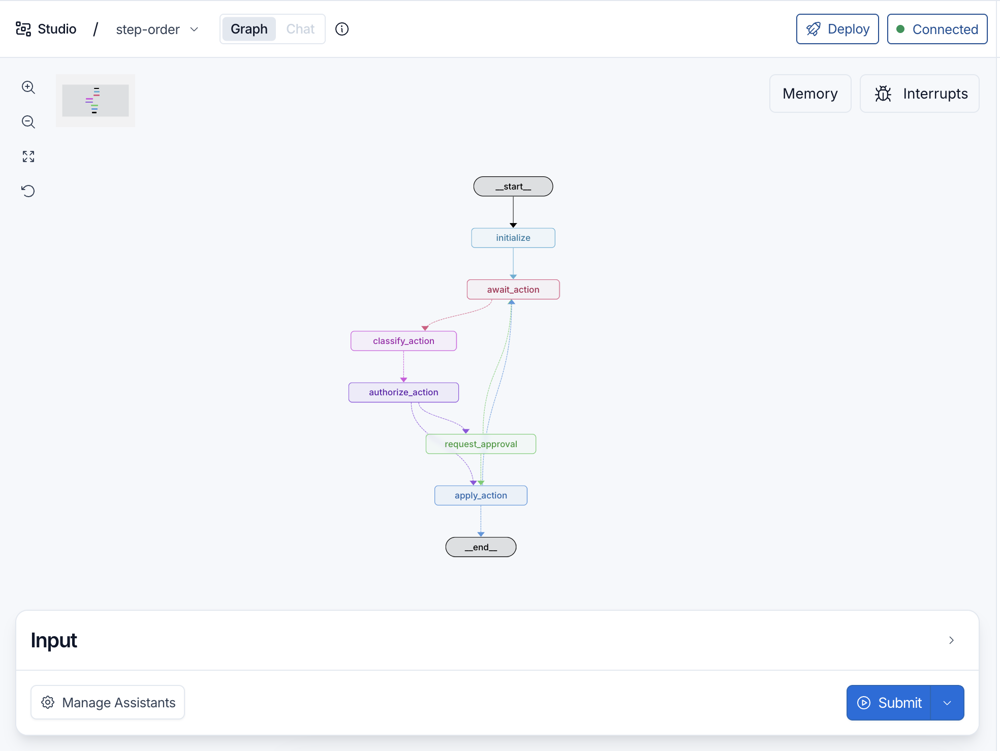</a><br><sub>01 · LangGraph workflow</sub></td>
    <td align="center"><a href="docs/screenshots/02-dual-user-empty-dashboard.png">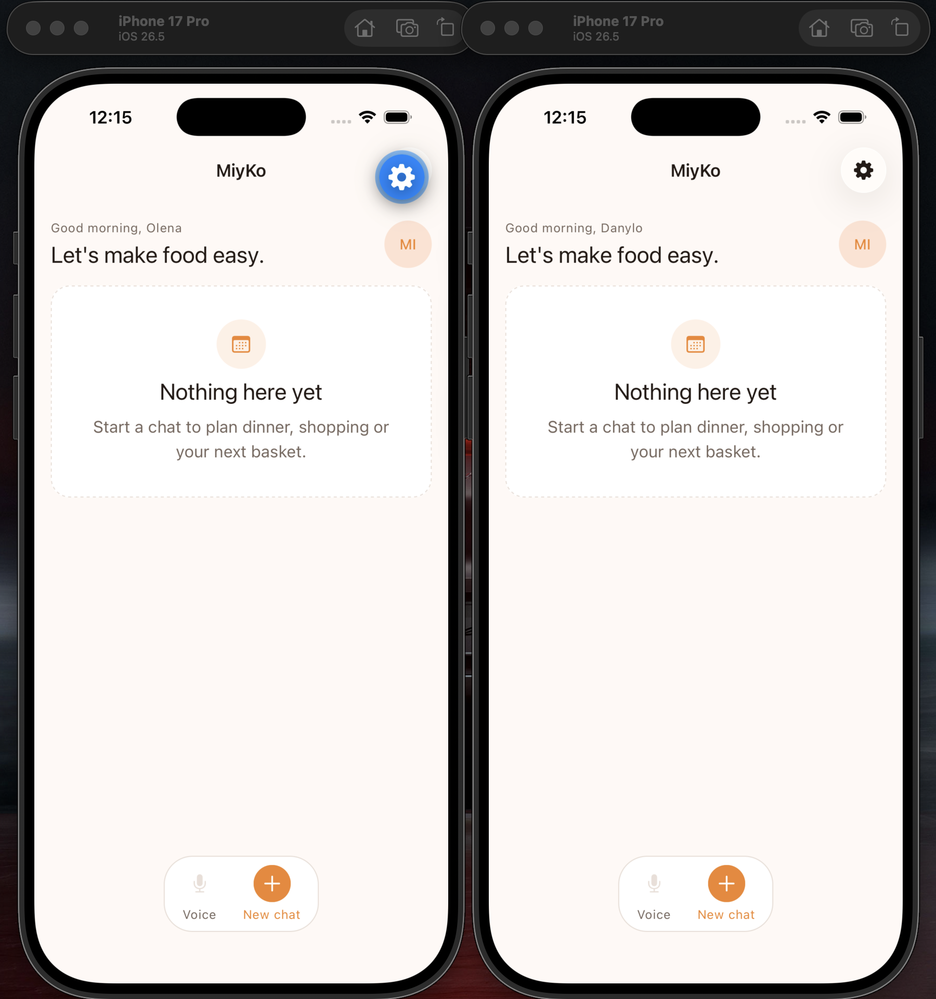</a><br><sub>02 · Owner and viewer</sub></td>
    <td align="center"><a href="docs/screenshots/03-household-members-and-provider.png">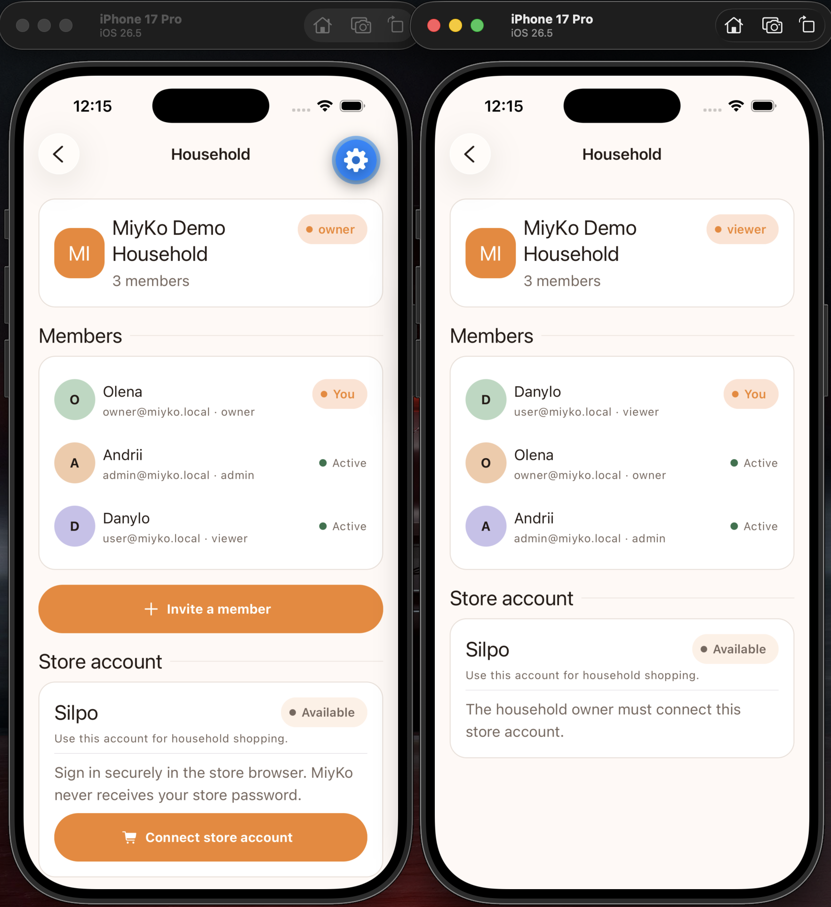</a><br><sub>03 · Household and roles</sub></td>
  </tr>
  <tr>
    <td align="center"><a href="docs/screenshots/04-silpo-oauth-authorization.png">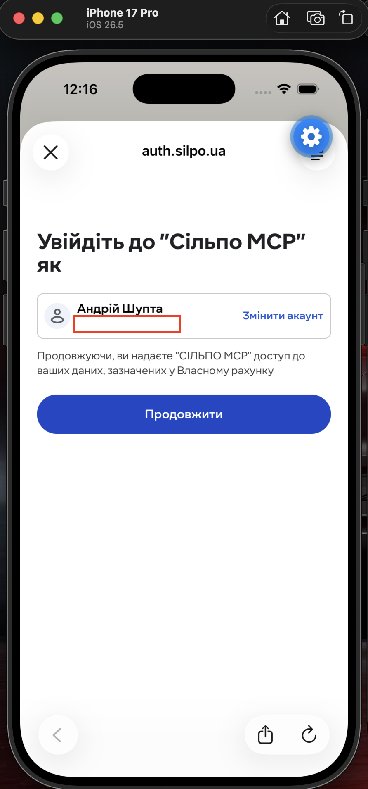</a><br><sub>04 · Silpo OAuth</sub></td>
    <td align="center"><a href="docs/screenshots/05-mem0-order-history-memories.png">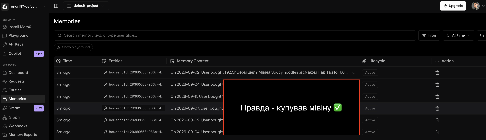</a><br><sub>05 · Order-history memory</sub></td>
    <td align="center"><a href="docs/screenshots/06-owner-order-dashboard.png">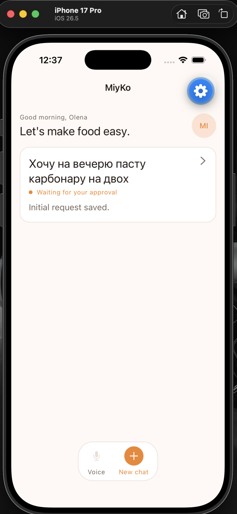</a><br><sub>06 · Owner starts an order</sub></td>
  </tr>
  <tr>
    <td align="center"><a href="docs/screenshots/07-step-order-initial-plan.png">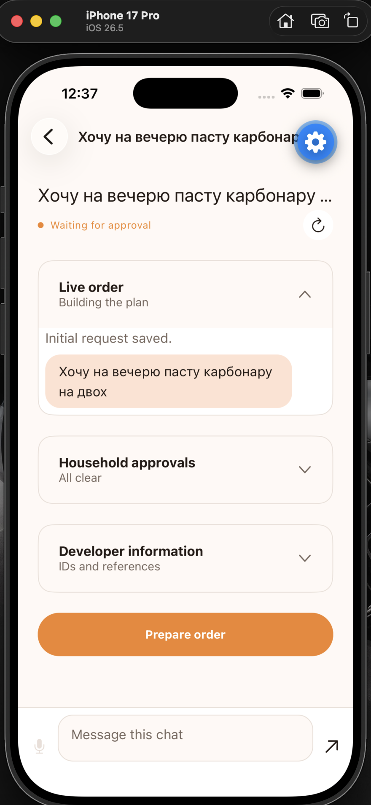</a><br><sub>07 · Initial order plan</sub></td>
    <td align="center"><a href="docs/screenshots/08-silpo-basket-ready.png">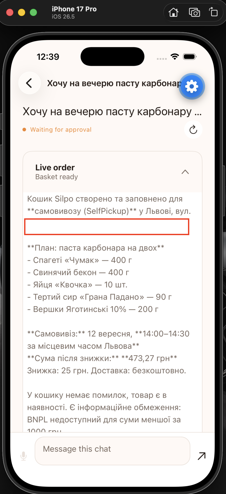</a><br><sub>08 · Basket ready</sub></td>
    <td align="center"><a href="docs/screenshots/09-silpo-mcp-workflow-logs.png">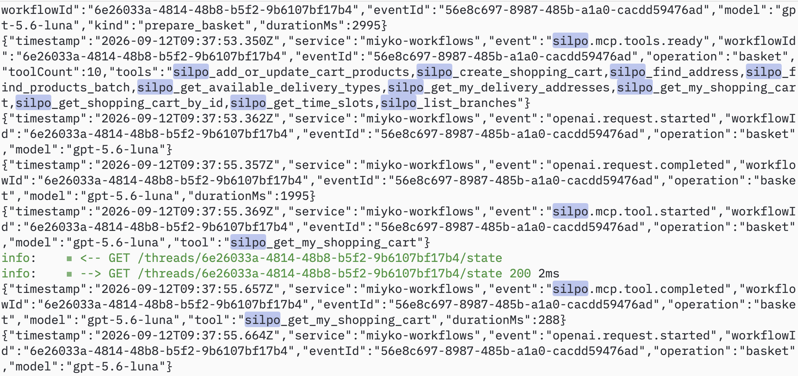</a><br><sub>09 · Real MCP tool calls</sub></td>
  </tr>
  <tr>
    <td align="center"><a href="docs/screenshots/10-household-approval-flow.png">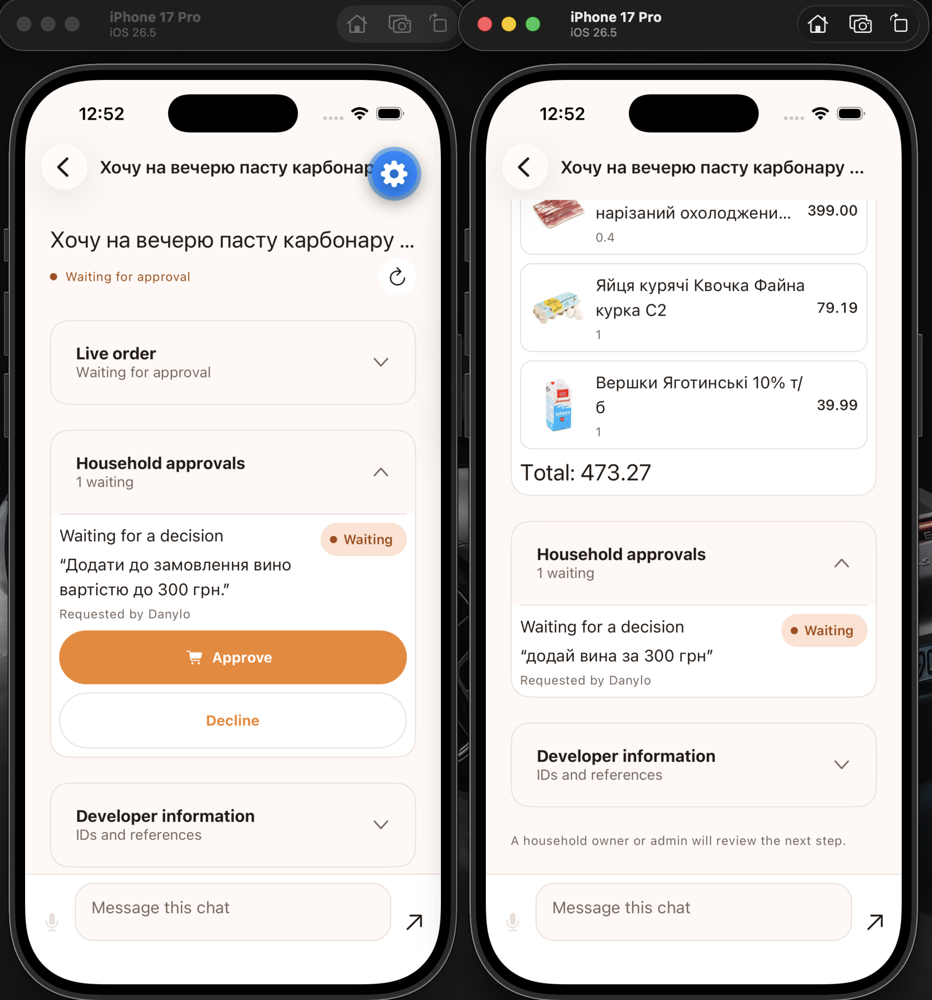</a><br><sub>10 · Household approval</sub></td>
    <td align="center"><a href="docs/screenshots/11-silpo-checkout-basket.png">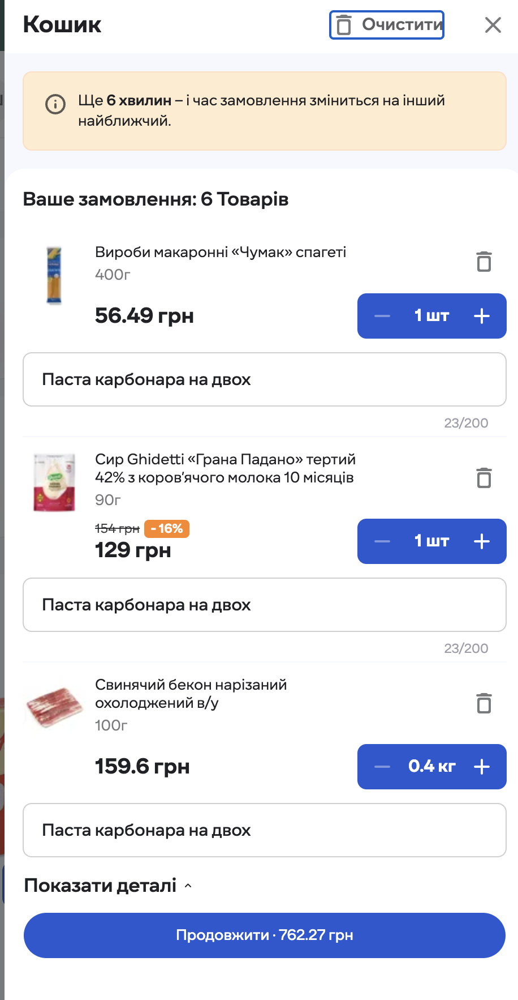</a><br><sub>11 · Silpo checkout basket</sub></td>
    <td align="center"><a href="docs/screenshots/12-completed-order-dashboard.png">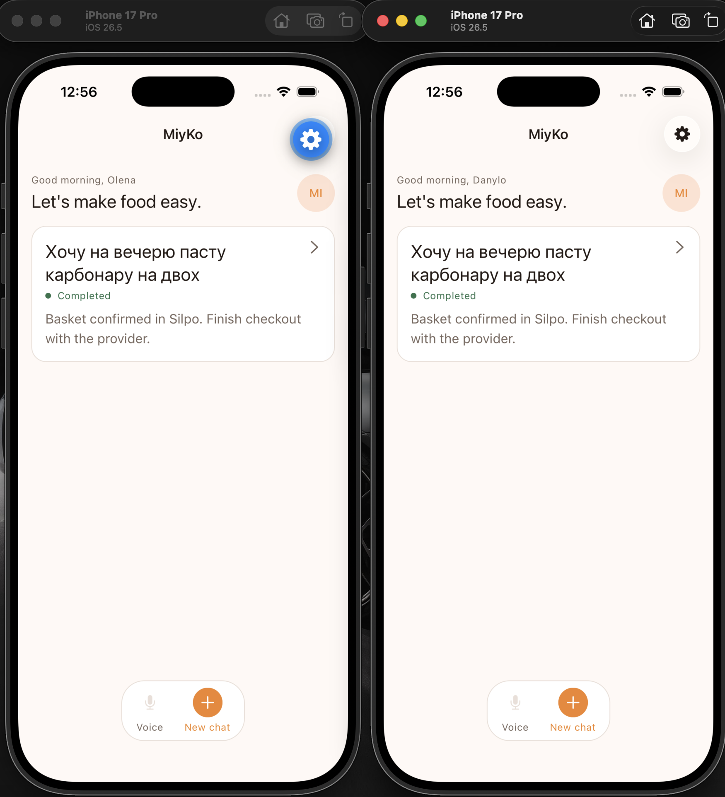</a><br><sub>12 · Workflow completed</sub></td>
  </tr>
  <tr>
    <td align="center"><a href="docs/screenshots/13-mem0-memory-dashboard.png">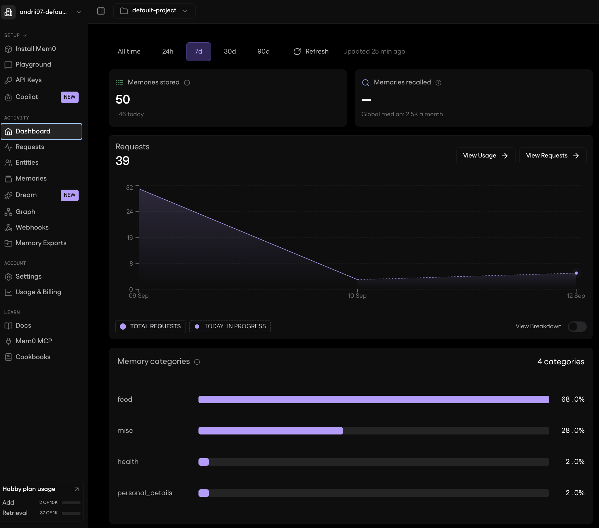</a><br><sub>13 · Long-term memory</sub></td>
    <td></td>
    <td></td>
  </tr>
</table>

## Repository

```text
apps/app/            Expo / React Native client
apps/api/            Hono API and outbox worker
apps/workflows/      Local LangGraph application and `step-order` graph
packages/contracts/  Public API types and Zod schemas
packages/database/   Drizzle schema, RLS and one baseline migration
docs/                Product, workflow and architecture documentation
```

More documentation:

- [Product idea](docs/idea.md)
- [Product requirements](docs/prd.md)
- [Architecture](docs/architecture.md)
- [LangGraph workflow](docs/graph.md)
- [Graph/API contract](docs/graph-contract.md)
- [Ukrainian demo script](docs/demo-script.md)

## Security and ownership

Authentication and authorization are enforced by the API and database RLS. MiyKo email/password authenticates only the MiyKo user. The household owner connects Silpo through OAuth 2.1 Authorization Code with PKCE; MiyKo stores encrypted owner-scoped credentials and binds the provider account once to the household. Other members use that household connection without receiving the credential.

The API passes the current provider access token to each workflow run as runtime-only context. It never enters Expo, LangGraph state or Mem0 memory. LangGraph owns workflow checkpoints; Mem0 owns long-term memory; Silpo remains authoritative for products, basket and checkout. Missing integrations fail explicitly, with no mock or silent fallback path.

## Development check

Run `pnpm typecheck` from the repository root to type-check every TypeScript workspace. GitHub Actions runs the same command for pushes and pull requests.

## License

MiyKo is licensed under the [Apache License 2.0](LICENSE). Use, modification and distribution are permitted under its terms, including preservation of the applicable license and attribution notices. See [NOTICE](NOTICE) for project attribution.
